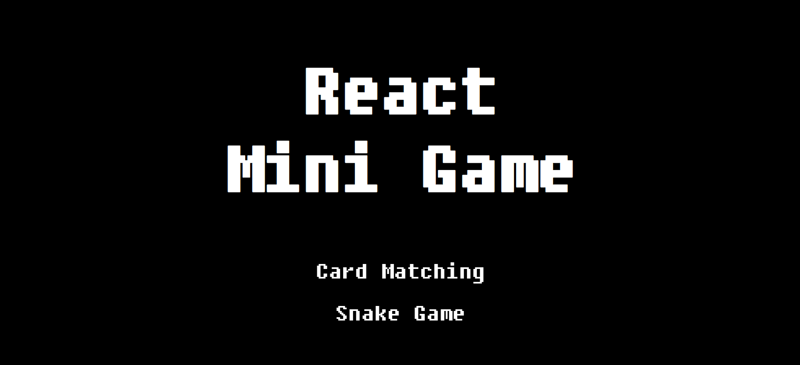
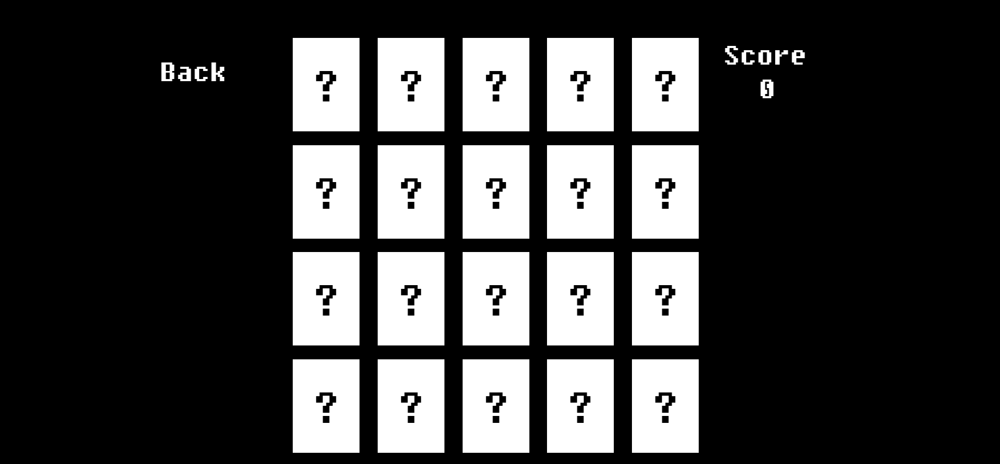
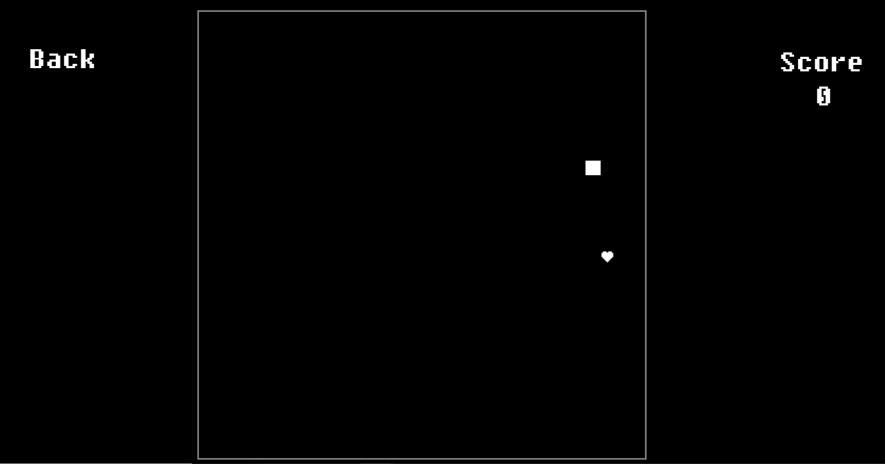

# 2021-1 React Study

#### ✏ 2021 1학기에 진행한 React 스터디 입니다. 
#### ✏ 매주 주제별로 각자 공부 및 조사해오고, 이를 발표한 뒤 내용 통합해서 정리
#### ✏ [최종 정리 페이지](https://www.notion.so/Wiki-509b2109f078431ebf39832d9ecb867e)
 

# React Mini-Game
### 🎮 React Study Final Project 
### 🎮 Card matching game & Snake game with React
### 🎮 [Play game here!](https://wish1030.github.io/Mini-Game/) 

 

 ### 🏠 홈화면
 
### 🃏 카드게임 화면

### 🐍 스네이크 게임 화면

 

# Getting Started with Create React App
This project was bootstrapped with [Create React App](https://github.com/facebook/create-react-app).
